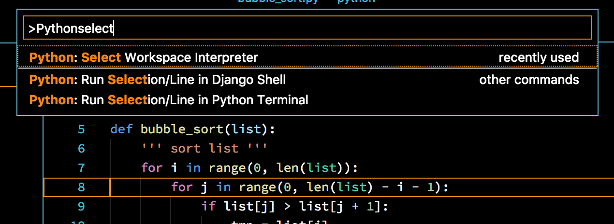
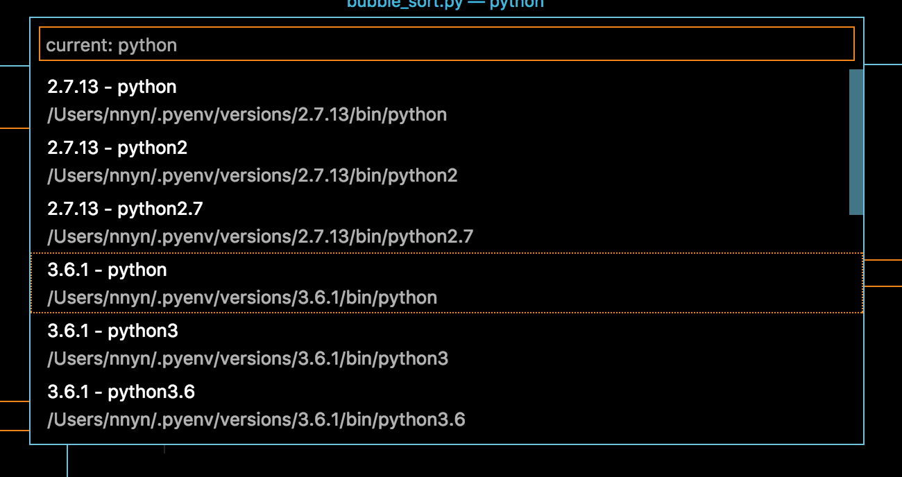
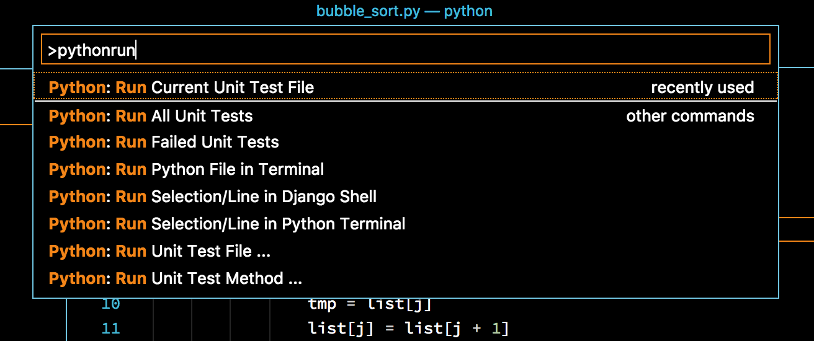
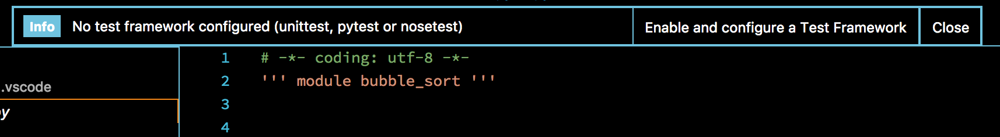
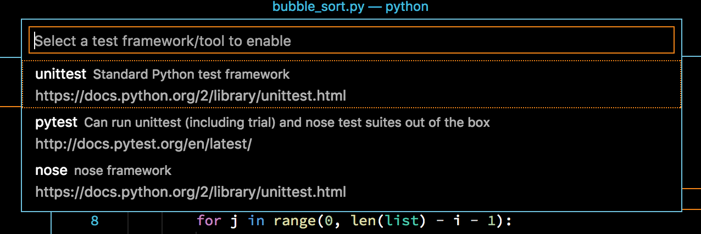
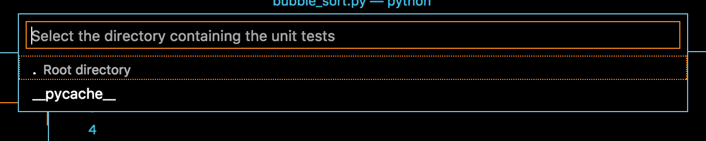
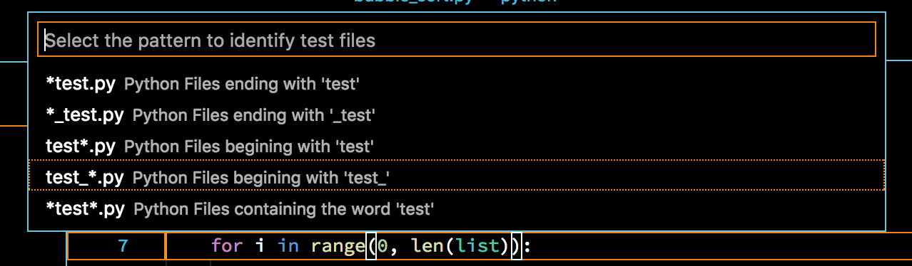
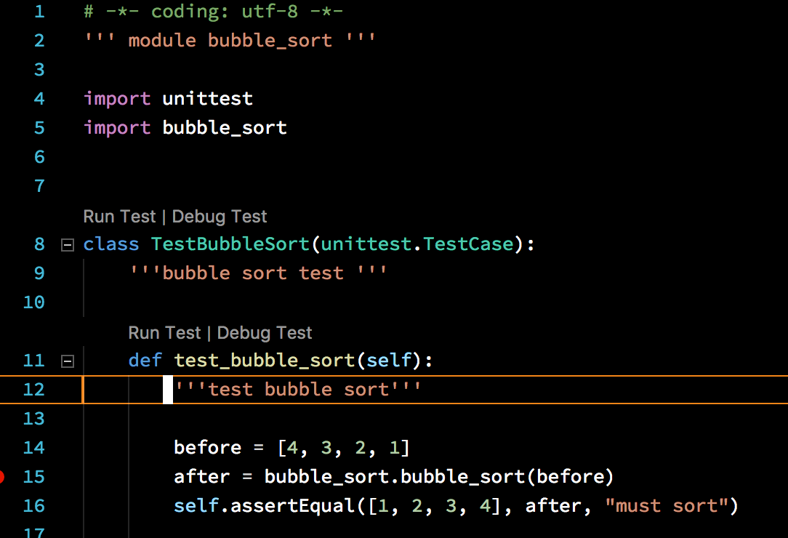

# How to Debug Python with VS Code

## Summary

- [Basic](#basic)
- [Spec](#spec)
- [Instruction](#instruction)
- [unit test](#unit-test)
- [executable file debug](#executable-file-debug)

## Basic

- [Python.org](https://www.python.org/)
- Extension: [Python](https://marketplace.visualstudio.com/items?itemName=ms-python.python) `ms-python.python`
- Debugger: Python
- module code: [bubblesort/bubblesort_logic.py](https://github.com/vscode-debug-specs/python/blob/master/bubblesort/bubblesort_logic.py)

## Spec

- OS
  - ✅ MacOS
  - ✅ Windows
  - ✅ Linux
- Break Point
  - ✅ break point
  - ✅ condition break point
  - ❌ function breakpoint
  - ✅ uncaught exception breakpoint
  - ✅ all exception breakpoint
- Step Execution
  - ✅ Step Over
  - ✅ Step Into
  - ✅ Step Out
  - ✅ Continue
- Variables
  - ✅ variables views
  - ✅ watch variables
- Call Stack
  - ✅ call stack
- Evaluation
  - ✅ eval expression to show variables
  - ✅ eval expression to change variables
- Type of Execution
  - ✅ debug unit test
  - ✅ debug executable package
  - ✅ remote debugging

## Instruction

Only installing Extension.

### additional

If you want to pyenv or other environment tools, select your environment with belong way.

`F1`->`Python: Select Workspace Interpreter`





## unit test

- test code: [bubblesort/test/test_bubblesort.py](https://github.com/vscode-debug-specs/python/blob/master/bubblesort/test/test_bubblesort.py)

### inline

`F1`->`Python: Run Current Unit Test File`



`Enable and configure a Test Framework.`->select your test framework.




sample: `unittest`->`.`->`test_*`




Codelens on test function shows run and debug test button.



But it sometimes doesn't start debug in my machine. Then, it restarts VS Code and retry.

### use launch.json

Menu: Python:Python module

```json
{
  "version": "0.2.0",
  "configurations": [
    {
      "name": "Python Module",
      "type": "python",
      "request": "launch",
      "module": "unittest",
      "args": [
        // test package
        // <test_file>
        // <test_file>.<test_class>
        // <test_file>.<test_class>.<test_method>
        "bubblesort.test.test_bubblesort"
      ]
    }
  ]
}
```

## executable file debug

executable file: [main.py](https://github.com/vscode-debug-specs/python/blob/master/main.py)

### launch.json

```json
{
  "version": "0.2.0",
  "configurations": [
    {
      "name": "Python",
      "type": "python",
      "request": "launch",
      "program": "${workspaceFolder}/main.py",
      "args": ["4", "3", "2", "1"]
    }
  ]
}
```

## execute module debug

module : [bubblesort](https://github.com/vscode-debug-specs/python/tree/master/bubblesort)

### launch.json

```json
{
  "version": "0.2.0",
  "configurations": [
    {
      "name": "Python",
      "type": "python",
      "request": "launch",
      "module": "bubblesort",
      "args": ["4", "3", "2", "1"]
    }
  ]
}
```

## remote debug

### prepare

install pyvsd package

```sh
pip install ptvsd
```

### code

add remote debug code.

```python
import ptvsd

ptvsd.enable_attach("nnyn", address=('0.0.0.0', 3333))
ptvsd.wait_for_attach()
```

run follow command.

```sh
python bubble_sorter_for_remote.py 4 3 2 1
```

### launch.json

```json
{
  "version": "0.2.0",
  "configurations": [
    {
      "name": "Attach (Remote Debug)",
      "type": "python",
      "request": "attach",
      "pathMappings": [
        {
          "localRoot": "${workspaceFolder}",
          "remoteRoot": "/home/nnyn/vscode-debug-specs/python"
        }
      ],
      "port": 3333,
      "host": "127.0.0.1"
    }
  ]
}
```
